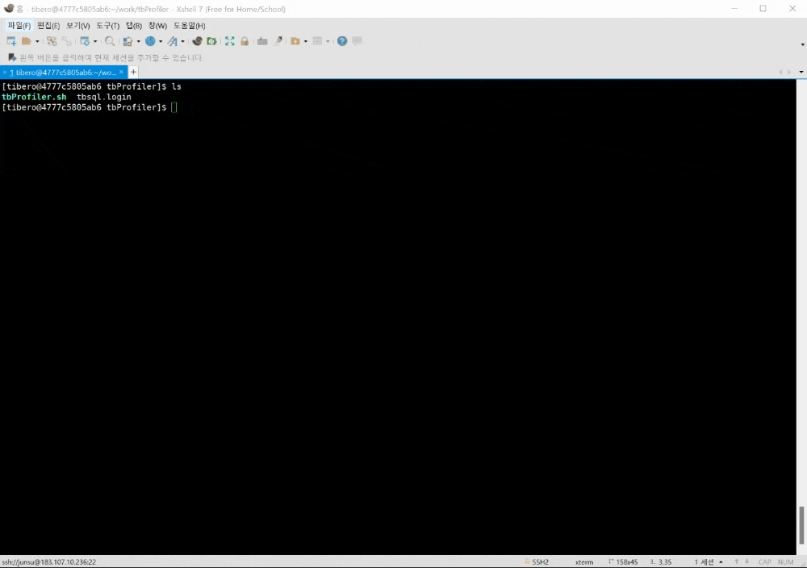

```
[tibero@4777c5805ab6 tbProfiler]$ sh tbProfiler.sh 

###############################
 tbProfiler mode help message
###############################
 usage: sh tbProfiler.sh [option]
-----------------------------
  run  : start tbsql Profiler
  help : help message
-----------------------------

```

```
[tibero@4777c5805ab6 tbProfiler]$ more tbProfiler.sh 

... skip ...

# user configuration
#--------------------------------------------------------------------------------
TBSQL_USER=""
TBSQL_PASSWORD=""
TB_SQLPATH=""
SQL_TRACE_FILE_PATH=""
#--------------------------------------------------------------------------------
#TB_NLS_LANG=UTF8
#LANG=ko_KR.utf8
#stty erase ^H
#stty erase ^?
#--------------------------------------------------------------------------------

... skip ...

````


